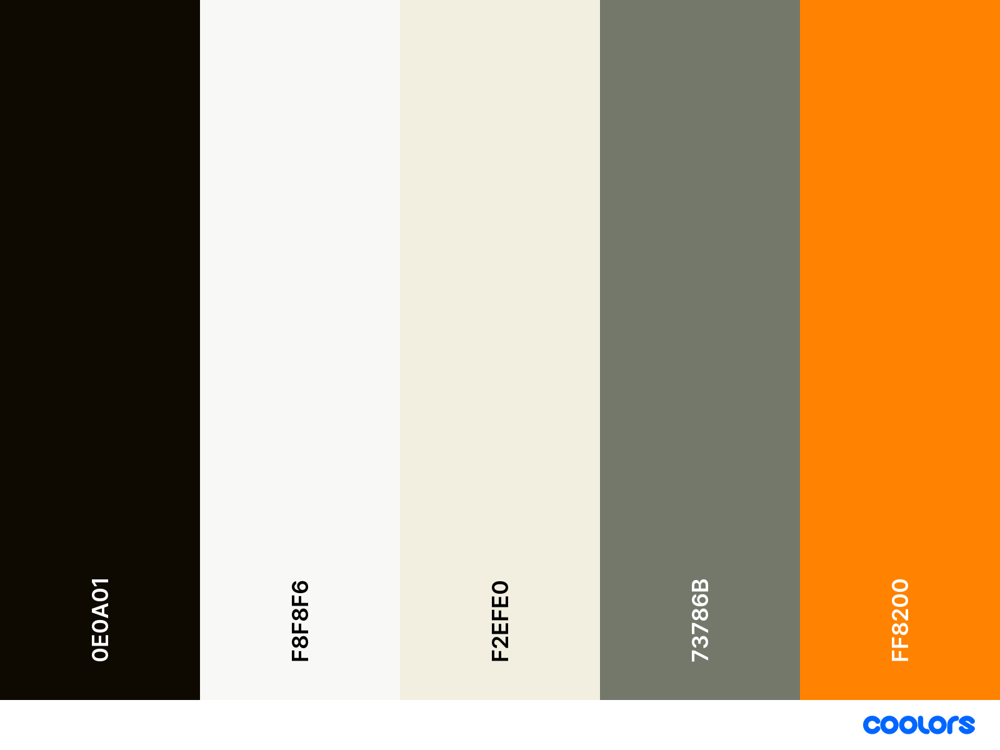

# Ghost

## Intro

This documentation is for our blog: [The Workbench (blog.leblanc.sh)](https://blog.leblanc.sh). Our Ghost instance is self-hosted in Digital Ocean.

Credentials for Digital Ocean are provided in 1Password.&#x20;

Please see [infrastructure-configuration.md](infrastructure-configuration.md "mention") for a diagram of how Digital Ocean fits into our enrivonment.&#x20;

## Managing The ghost-prod Droplet

Most management things can be done via the Digital Ocean console (upgrade instance size, restarting, etc)

If you need to manage either the Ghost install itself, Ubuntu, or any other isntalled service on this droplet you will need to SSH into ghost-prod. Please use the public IP for this instance. The root password for the instance is found in 1Password.&#x20;

The DNS A-Record for blog.leblanc.sh is managed in Netlify.&#x20;

## Modifying Our Theme

The theme we currently have is a modification of the default Ghost "Journal" Theme. Our current theme is stored in GitHub here:

Please follow the README instruction in that repo for more detailed instructions on how to correectly modify and package the theme.

### Style Guide

Our current style guide is as follows:

Body Type: Roboto Mono

Heading Type: Canela Thin

Primary Color Light: #F2EFE0

Primary Color Dark: #0E0A01

Secondary Color: #73786B

## Managing The Workbench Itself

All blog management tasks, creating new posts, creating new users, uploading updated themes, etc is done from the Ghost console. To access the Ghost console please navigate to: [blog.leblanc.sh/ghost](https://blog.leblanc.sh/ghost)

The credentials for the Ghost console are available in 1Password.
