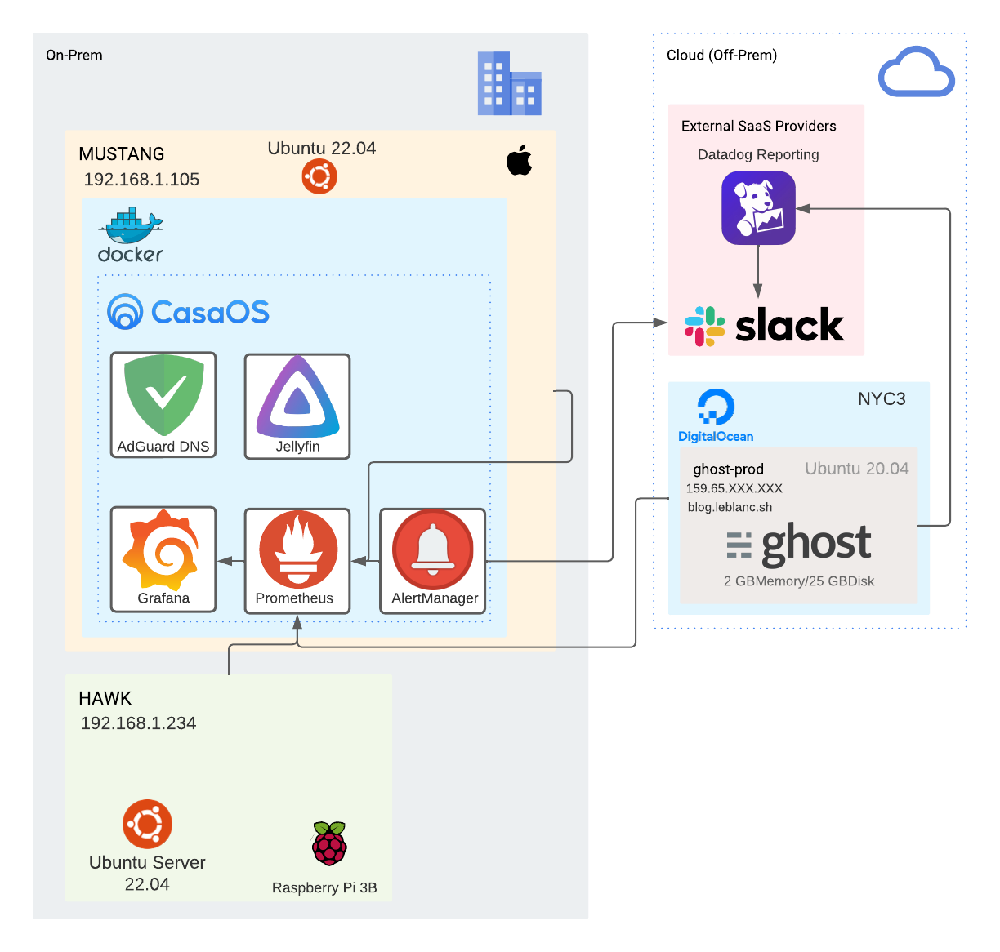

# ⚙ Infrastructure Configuration

<figure><figcaption></figcaption></figure>

### To Do

* [ ] Edit Diagram to show Cloudflare Tunnel
* [ ] Edit Diagram to show additional reporting to Datadog
* [ ] Edit Diagram to show additional containers etc

Google Cloud Setup [DEPRECATED]

[https://i.imgur.com/mFwfkY0.png](https://i.imgur.com/mFwfkY0.png)

On-Prem Setup [DEPRECATED]

Our on-prem setup was configured as below. This has now been decomissioned during our move.&#x20;

[https://i.imgur.com/AhvhTsZ.png](https://i.imgur.com/AhvhTsZ.png)

##

